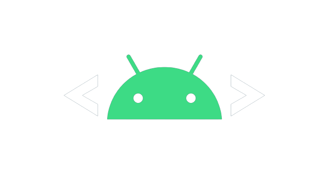

<h1 align="center">Hi 👋, I'm Hoàn</h1>
<h2 align="center">A passionate Web developer from Việt Nam</h2>
<h3 align="center">Interested in Dapp, Web3, Smart Contract</h3>

  

## - 🌱 I’m currently learning ** ReactJS,NodeJS, Automation ...**

## - 📫 How to reach me **khaihoan.work@gmail.com**

---

<h2 align="left">Connect with me:</h2>

&nbsp;&nbsp;&nbsp;&nbsp;&nbsp;&nbsp;&nbsp;&nbsp;&nbsp;
&nbsp;
&nbsp;

<!--  -->

<h2 align="left">Languages and Tools:</h2>

- <h3 align="left">Programming Languages</h3>
  
  
  <!--   -->
  <!--  -->
  <!--  -->
  
   &nbsp;
  

- <h3 align="left">Frontend Development</h3>
   &nbsp;
   &nbsp;
   &nbsp;
   &nbsp;
- <h3 align="left">Automation Development </h3>
  <!-- 
  
   -->
   &nbsp;&nbsp;
  
  <!--  -->

- <h3 align="left">Backend Development ( Basic level )</h3>
   &nbsp;&nbsp;
  
  
  
  <!--  -->

- <h3 align="left">Other ( Low level )</h3>
   &nbsp;
   &nbsp;
   &nbsp;
  

- <h3 align="left">Interested In</h3>
   &nbsp;
  <!--  &nbsp; -->
  <!--  &nbsp; -->
  
  

&nbsp;

